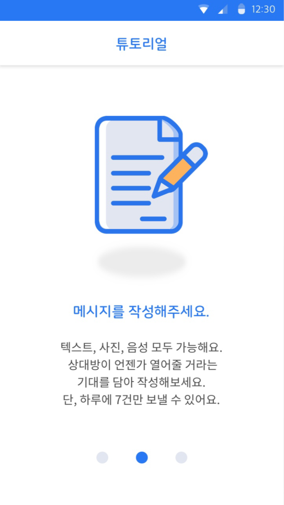

# find-my-capsule-backend

## Amathon 1th 4team 'JOIN AND JOIN AND JOIN'

## About
- 주제
  - GPS기반 데이터 송수신 앱 만들기
- 요구사항
  1. 메세지 송신시 특정 위치를 지정하여 송신한다.
  2. 메세지는 텍스트, 사진, 음성을 송신할 수 있다.
  3. 송신자는 2가지 옵션이 있다.
      1. 수신자에게 알람이 가는 옵션
      2. 수신자에게 알람이 가지 않는 옵션
  4. 수신자는 해당 위치로 가면 메시지를 수신하며, 지도에 핀이 찍혀 기록이 된다.
- 기간
  - 18.07.20 ~ 18.07.21
- 팀원소개
  - 개발자 : 김태준, 이준규, 조현우
  - 디자이너 : 고정민
- 역할
  - API 개발
  - DB 모델링
  
## Architecture

## Preview

|  |  |  |
|:---:|:---:|:---:|
|  |  |  |
